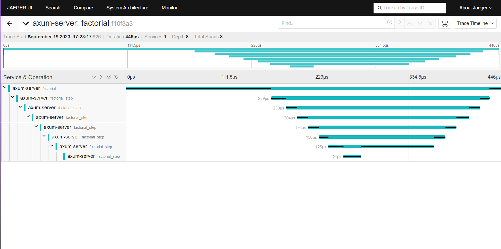

# axum-template

A custom starter for Rust's [`axum`](https://github.com/tokio-rs/axum) web framework.

## Features

- Error handling, backtraces and spantraces using [`color-eyre`](https://github.com/eyre-rs/color-eyre)
- Tracing and instrumentation using [`tracing`](https://github.com/tokio-rs/tracing) 
with `tracing-subscriber` for local traces and `tracing-error` for panics
- Support for UI-based tracing in [Jaeger](https://www.jaegertracing.io) 
via [`tracing-opentelemetry`](https://github.com/tokio-rs/tracing-opentelemetry) 
and [`opentelemetry-jaeger`](https://github.com/open-telemetry/opentelemetry-rust/tree/main/opentelemetry-jaeger)
- Concurrency limiting and request timeouts using [`tower`](https://github.com/tower-rs/tower) and [`tower-http`](https://github.com/tower-rs/tower-http)
- Graceful shutdown on <kbd>Ctrl</kbd>+<kbd>C</kbd>

## Setup

To use this template you need:
- [Rust](https://www.rust-lang.org/tools/install)
- [Docker Desktop](https://www.docker.com/products/docker-desktop/)

Then clone the repo:
```
git clone https://github.com/ScratchCat458/axum-template
cd axum-template
```

To spin up the instance of Jaeger, a Docker Compose file is provided in this repo.
Whilst Docker Engine is running, run the container in the background:
```
docker compose up -d
```
To teardown the container, whilst in the project directory:
```
docker compose down
```

To run the server as is:
```
cargo run
```

It should be accessible from `localhost:3000`

## Example Routes

- The root route `/` returns the text `Hello, Axum!` and prints the same text as `info!` span.
- `/panic` intentionally causes a panic which will be shown by `color-eyre`.
This may be triggered multiple times as your browser may try to refetch the contents of the route.
- `/cargo` returns this project's `Cargo.toml` using `tower-http`'s [`ServeFile`](https://docs.rs/tower-http/latest/tower_http/services/struct.ServeFile.html) service.
- `/factorial/:num` calculates the factorial of some input number using recursive methods.
This is a good example to look at in Jaeger.


## Possible Modifications

If you are just beginning with `axum`, here are some things you can try.

- Try adding some traces (`info!`, `debug!`, `trace!`) to the `factorial`
and `factorial_step` functions to see the traversal in your terminal and Jaeger
- Change the `panic_section` in `setup` to a custom message suitable for your project,
and change the repository url in `Cargo.toml` so that issue url in the panic message matches your repo.
- Add, remove and/or modify the `tower` `Layer`s in `Router` to control the behaviour of the server


